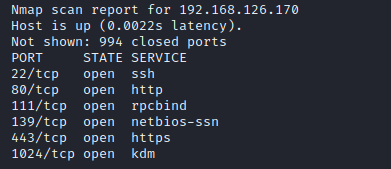
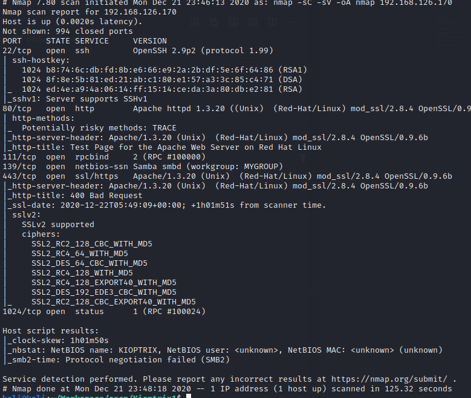

## Host detection

We can either run 

```
netdiscover -r 192.168.126.0/24
```

or
```
nmap 192.168.126.*
```



## Enumaration

We'll run Nmap scan to enumarate the network and will start checking for usual ports i.e 80, 443.

```
namp -sC -sV <ip> -oN nmap
```


Apache looks to be outdated. Checking exploitdb for know vulnarabilities.

## Smb enum

Running enum4linux to enumarate samba

```bash
   
 ==========================================   
|    Share Enumeration on 192.168.1.104    |  
 ==========================================   
WARNING: The "syslog" option is deprecated  
Domain=[MYGROUP] OS=[Unix] Server=[Samba 2.2.1a]  
Domain=[MYGROUP] OS=[Unix] Server=[Samba 2.2.1a]  
  ```

The version seems to be outdated

## Exploit
* For Apache we can use: OpenFuck.c exploit
* For samba we can use Samba < 2.2.8 (Linux/BSD) - Remote Code Execution https://www.exploit-db.com/exploits/10
